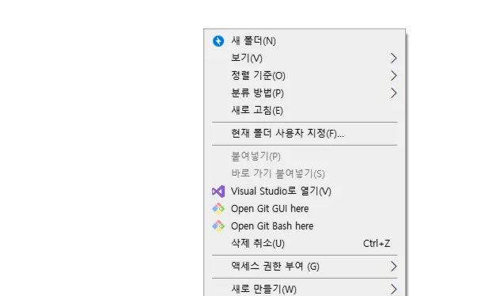
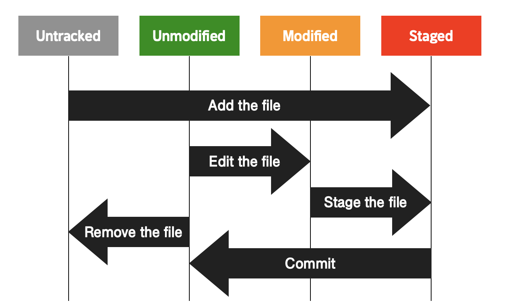

# git 사용법 정리

작성일시: 2025년 7월 8일 오후 6:18
수업날짜: 2025년 7월 8일

# git 시작하기

## local repository

(window 기준) [Git 설치하기](https://git-scm.com/) 



원하는 working directory에서 **open git bash here** 선택을 하면 원하는 위치에서 repository를 생성, git으로 관리를 시작할 수 있다. 

또는 

직접 git bash에서 git init을 통해 repository를 생성할 수 있다. 

git을 사용하기 위해선 사용자 설정이 필요하다.(필수!) git bash나 VScode 터미널에서 아래 명령어 사용

```jsx
$ git config user.name "유저명"
$ git config user.email "email주소"
```

위의 과정을 끝내면 local repository에서 git을 사용할 준비가 끝난다.

## 커밋 (commit)

커밋은 작업 내용의 ‘스냅샷’을 의미하며, 한 번 커밋하면 이력이 남는다. 문제가 발생했을 때 이전 상태로 쉽게 되돌릴 수 있는 Git에서 관리하는 가장 작은 단위의 버전. 그리고 커밋을 위해서는 staging area에 작업물을 올리는 add 과정이 필요하다.

## Git의 3가지 작업 영역

working directory : 작업을 하는 중인 프로젝트 디렉토리

staging area : git add를 한 파일들이 존재하는 영역, 이 **staging area에 있는 파일들만 커밋에 반영**된다. 

repository : working directory의 변경 이력이 저장되는 곳. commit들이 저장되는 영역이다.

**working directory**

⬇️ git add [파일/폴더]

**staging area**

⬇️ git commit 

**repository**

즉, 한번에 commit이 가능하지 않고 add를 해서 작업물들을 staging area에 보내야 commit이 가능해진다.

## Git의 파일 status

### Untracked 상태

추적되지 않고 있는 상태. 즉, git이 추적하지 않고 있다는 의미로 파일을 새로 생성하고 한 번도 git add를 해주지 않았다면 이 상태이다.

### Tracked 상태

git이 변동사항을 추적하고 있는 상태.

- Staged 상태
    
    파일의 내용이 수정되고나서, staging area에 올라와 있는 상태. (git add를 한 상태)
    
- Unmodified 상태
    
    현재 파일의 내용이 최신 커밋의 모습과 비교했을 때 전혀 바뀐 게 없는 상태.
    
- Modified 상태
    
    최신 커밋의 모습과 비교했을 때 조금이라도 바뀐 내용이 있는 상태.
    



git reset [파일 이름] : staging area에 올렸던 파일 다시 내리기. git add 취소.

git status : Git이 현재 인식하고 있는 프로젝트 관련 내용들 출력.

리셋 리벌트 레포짓

## 로컬 저장소와 원격 저장소

위에서 해왔던 작업은 전부 local에서의 작업으로 개인 컴퓨터에서 Git 관리를 하는 과정이다. 이를 원격 저장소에 올릴 수 있는데 이를 remote rpository라고 하며 인터넷으로 접근이 가능해 여러 사람과 협업하거나 백업을 생성할 수 있다. 

원격 저장소는 일반적으로 github를 사용한다. 

1. github에서 repository 생성
2. git remote (local과 remote 연결)

```jsx
$ git remote add origin [github repository 주소].git
$ git remote push -u origin master(or main)
```

github와 연결시에 username과 token이 필요하다. github 계정에서 setting → Developer settings 에서 token을 생성할 수 있다. 또는 그냥 브라우저를 통해 인증을 받을 수 있다.

1. remote 연결 확인

```jsx
$ git remote [-v]
/* -v 옵션을 붙이면 단축이름과 remote url을 함께 확인할 수 있다. */
```

1. local 파일을 remote에 올리기

```jsx
$ git push --set-upstream origin main 
/* origin: remote repository 이름, main: local 이름*/
```

local repository에 있는 main 브랜치의 모든 커밋들을 remote에 push 한다. 이때 최초로 push를 할때는 —set-upstream 옵션을 주어야한다. 이 옵션을 사용하면 **local repository에 있는 main 브랜치가 origin에 있는 main 브랜치를 tracking**하는 걸로 설정된다. **tracking이라는 건 local repository의 한 브랜치가 remote repository의 브랜치와 연결되어 그것을 계속 바라보는 상태**를 의미한다. 이 상태를 **tracking connection**이라고 한다. tracking connection을 한 번 해두면 현재 main 브랜치에 있을때 git push, git pull만 사용해서 push, pull을 할 수 있다. 

## 브랜치 (branch)

Git의 브랜치는 독립적으로 작업을 진행하고 그 결과를 저장할 수 있는 개별적인 흐름을 의미한다. 브랜치를 사용하면, 서로 다른 작업을 별도로 진행하고 **나중에 하나의 코드베이스로 병합**할 수 있다. 브랜치는 특정 커밋을 가리키는 참조(reference) 역할로 브랜치 자체가 “커밋”이 되는 것은 아님을 명심.

## Git command

- **git init** : 현재 디렉토리를 Git이 관리하는 프로젝트 디렉토리(=working directory)로 설정하고 그 안에 레포지토리(.git 디렉토리) 생성
- **git config** **user.name 'codeit'** : 현재 사용자의 아이디를 'codeit'으로 설정(커밋할 때 필요한 정보)
- **git config user.email 'teacher@codeit.kr'** : 현재 사용자의 이메일 주소를 'teacher@codeit.kr'로 설정(커밋할 때 필요한 정보)
- **git add [파일 이름]** : 수정사항이 있는 특정 파일을 staging area에 올리기
- **git add [디렉토리명]** : 해당 디렉토리 내에서 수정사항이 있는 모든 파일들을 staging area에 올리기
- **git add .** : working directory 내의 수정사항이 있는 모든 파일들을 staging area에 올리기
- **git reset [파일 이름]** : staging area에 올렸던 파일 다시 내리기
- **git status** : Git이 현재 인식하고 있는 프로젝트 관련 내용들 출력(문제 상황이 발생했을 때 현재 상태를 파악하기 위해 활용하면 좋음)
- **git commit -m "커밋 메시지"** : 현재 staging area에 있는 것들 커밋으로 남기기
- **git help [커맨드 이름]** : 사용법이 궁금한 Git 커맨드의 공식 메뉴얼 내용 출력

### **remote repository 관련 command**

- **git push -u origin master** : 로컬 레포지토리의 내용을 처음으로 리모트 레포지토리에 올릴 때 사용
- **git push** : 로컬 레포지토리의 내용을 리모트 레포지토리에 보내기
- **git pull** : 리모트 레포지토리의 내용을 로컬 레포지토리로 가져오기
- **git clone [프로젝트의 GitHub 상 주소]** : GitHub에 있는 프로젝트를 내 컴퓨터로 가져오기
채

### commit 관련 command

- **git log** : 커밋 히스토리를 출력
- **git log --pretty=oneline** : --pretty 옵션을 사용하면 커밋 히스토리를 다양한 방식으로 출력할 수 있습니다. --pretty 옵션에 oneline이라는 값을 주면 커밋 하나당 한 줄씩 출력해줍니다. --pretty 옵션에 대해 더 자세히 알고싶으면 [**이 링크**](https://git-scm.com/docs/pretty-formats)를 참고하세요.
- **git show [커밋 아이디]** : 특정 커밋에서 어떤 변경사항이 있었는지 확인
- **git commit --amend** : 최신 커밋을 다시 수정해서 새로운 커밋으로 만듦
- **git config alias.[별명] [커맨드]** : 길이가 긴 커맨드에 별명을 붙여서 이후로 별명으로 해당 커맨드를 실행할 수 있도록 설정
- **git diff [커밋 A의 아이디] [커밋 B의 아이디]** : 두 커밋 간의 차이 비교
- **git reset [옵션] [커밋 아이디]** : 옵션에 따라 하는 작업이 달라짐(옵션을 생략하면 --mixed 옵션이 적용됨)
    
    (1) HEAD가 특정 커밋을 가리키도록 이동시킴(--soft는 여기까지 수행)
    
    (2) staging area도 특정 커밋처럼 리셋(--mixed는 여기까지 수행)
    
    (3) working directory도 특정 커밋처럼 리셋(--hard는 여기까지 수행)
    
    그리고 이때 커밋 아이디 대신 HEAD의 위치를 기준으로 한 표기법(예 : HEAD^, HEAD~3)을 사용해도 됨
    
- **git tag [태그 이름] [커밋 아이디]** : 특정 커밋에 태그를 붙임
